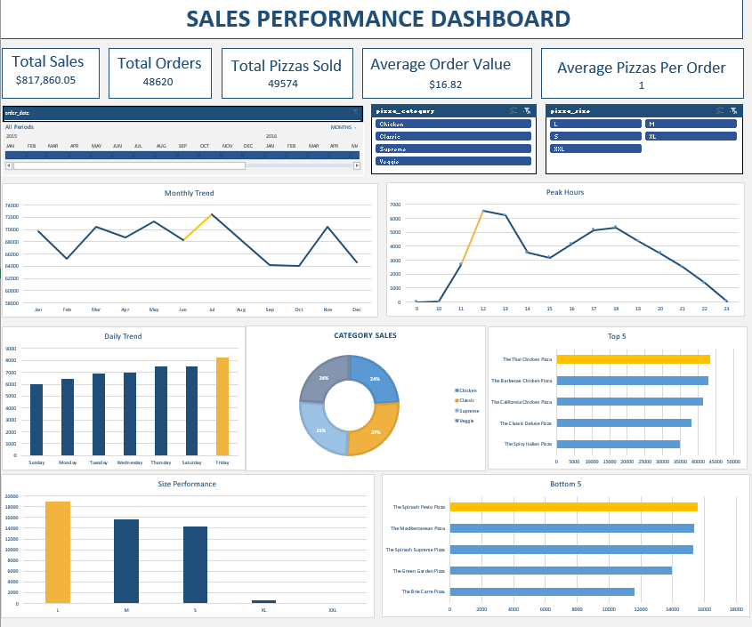

# Pizza Sales Performance Analysis 🍕📊

## Project Overview
This project focuses on analyzing sales data for a pizza restaurant to gain insights into customer purchasing patterns. The dashboard tracks key metrics such as total revenue, order volume, and peak ordering times to help improve operational efficiency and marketing strategies.

## Key Performance Indicators (KPIs)
* **Total Sales:** $817,860.05
* **Total Orders:** 48,620
* **Total Pizzas Sold:** 49,574
* **Average Order Value:** $16.82
* **Average Pizzas Per Order:** 1.00

## Key Insights
1. **Peak Hours:** Identified significant sales spikes during lunch (12 PM - 1 PM) and dinner (5 PM - 7 PM), suggesting optimal times for staffing.
2. **Category Performance:** Analyzed sales across categories (Classic, Supreme, Chicken, Veggie), with **Classic** and **Supreme** being the most popular.
3. **Daily & Monthly Trends:** Noticed higher order volumes on weekends (Friday/Saturday) and seasonal peaks in July and January.
4. **Size Performance:** **Large (L)** size pizzas are the top revenue contributors compared to other sizes.

## Tools Used
* **Microsoft Excel:** Data Cleaning, Pivot Tables, and Advanced Charting.
* **Data Visualization:** Interactive Slicers for filtering by Category and Pizza Size.

## Project Files
* `Pizza_Sales_Dashboard.xlsx`: The interactive Excel dashboard.
* `Images/`: Screenshots of the project.
